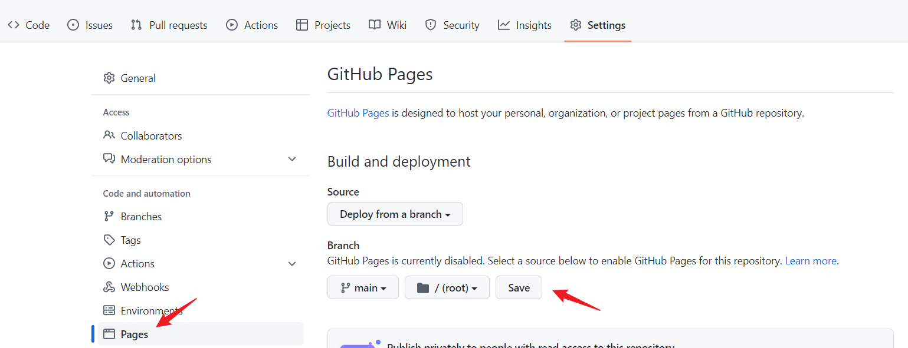

# 倉庫

* maven
* helm-charts

## 設定



## maven

> 測試打開 maven-metadata.xml
[https://yudady.github.io/repo/maven2/io/github/yudady/bilibili-video/maven-metadata.xml](https://yudady.github.io/repo/maven2/io/github/yudady/bilibili-video/maven-metadata.xml)

## maven used

```xml

<repositories>
	<repository>
		<id>repo-maven</id>
		<url>https://yudady.github.io/repo/maven2</url>
	</repository>
</repositories>

<dependencies>
    <dependency>
        <groupId>io.github.yudady</groupId>
        <artifactId>bilibili-video</artifactId>
        <version>0.0.1-SNAPSHOT</version>
    </dependency>
    
    <dependency>
        <groupId>io.github.yudady</groupId>
        <artifactId>utils</artifactId>
        <version>0.0.1-SNAPSHOT</version>
    </dependency>

</dependencies>
```

## gradle used

```groovy

repositories {
	mavenCentral()
	maven {
		url = uri("https://yudady.github.io/repo/maven2")
	}
	maven {
		url = uri("https://maven.pkg.github.com/yudady/io.github.yudady")
		credentials {
			username = "yudady"
			password = "這個密碼不能commit上去" 
		}
	}
}

dependencies {
	implementation 'org.springframework.boot:spring-boot-starter-web'
	testImplementation 'org.springframework.boot:spring-boot-starter-test'

	implementation 'io.github.yudady:utils:0.0.1-SNAPSHOT'
	implementation 'io.github.yudady:bilibili-video:0.0.1-SNAPSHOT'
}
```

## maven publish

```groovy

javadoc.options.encoding("utf-8")
java {
	withJavadocJar()
	withSourcesJar()
}

publishing {
	publications {
		maven2LocalRepo(MavenPublication) {
			groupId = 'io.github.yudady'
			artifactId = 'bilibili-video'
			version = '0.0.1-SNAPSHOT'

			from components.java
		}
	}

	repositories {
		maven {
			url = "file:///d:/tommy/github-repo/yudady/repo/maven2"
		}
	}
}
```

## helm-charts

* [bitnami](https://artifacthub.io/)

> https://registry.terraform.io/providers/hashicorp/helm/latest/docs/resources/release#example-usage---chart-url

```gotemplate
resource "helm_release" "example" {
name  = "redis"
chart = "https://charts.bitnami.com/bitnami/redis-10.7.16.tgz"
}
```


